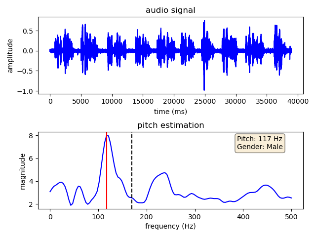
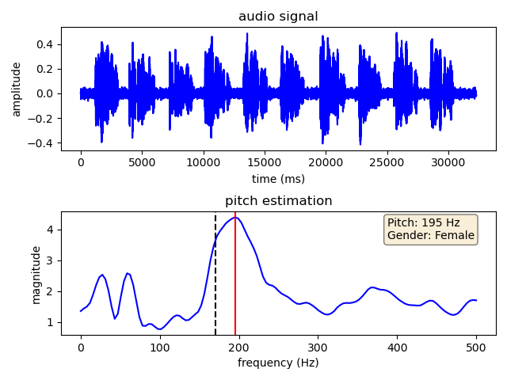

# Speech Gender Detection

Detect gender (male/female) from speech wav file, it is based on pitch estimation algorithm.
Lower pitch is classified as male, and higher pitch is classified as female.

## Clone

- Clone this repo to your local machine using
- $> git clone https://github.com/bangfutao/speech-gender-detection speech-gender-detection
  
## Tests

- speech-gender-detection$> python ./speech-pitch.py --wavfile ./OSR_uk_000_0022_8k.wav
- speech-gender-detection$> python ./speech-pitch.py --wavfile ./OSR_us_000_0019_8k.wav

## Test results

   
   

## Free samples
- URL: https://www.voiptroubleshooter.com/open_speech/index.html

---
## License

- **[MIT license](http://opensource.org/licenses/mit-license.php)**
